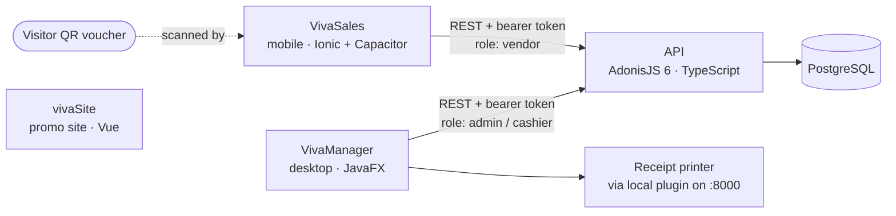

[Português](README.pt-BR.md)

#  VivaPay

**A closed-loop, voucher-based payment system built for a three-day school fair.**

VivaPay replaced cash at **VivaCTI**, the annual fair at CTI-UNESP (Bauru, Brazil). Visitors carried a QR-code voucher, which cashiers topped up at a desktop station. Vendors at 40 booths then charged it from a mobile app. A student team I led built it during our IT technician program (2022–2024). It ran live for 3 consecutive days, with 5,000+ users and 10,000 transactions.

---

## Impact

| Metric | Value |
|---|---|
| Live operation | 3 consecutive days at VivaCTI |
| Users | 5,000+ |
| Transactions | 10,000 |
| Vendor booths | 40 |
| Volume processed | ~BRL 10,000 |
| Team | 7 student developers, 2 faculty advisors |

---

## How it works

Three groups use the system, and each has its own client:

| Who | Client | What they do |
|---|---|---|
| Organizers / cashiers | **VivaManager** (desktop) | Create events and booths, top up or refund vouchers, print receipts, generate PDF reports, review cancellations |
| Vendors | **VivaSales** (mobile) | Log in, scan a visitor's QR voucher, check its balance, charge a payment, see sales history and receipts |
| Visitors | **Viva Voucher** (QR code) | Carry a QR-code voucher that holds a balance |

A voucher's balance is not stored as a mutable number. It is **derived from an append-only transaction log**: credits minus debits and refunds (`api/app/models/ClienteEvento.ts`). The API rejects a payment when the event is inactive, the vendor is not assigned to it, or the derived balance is insufficient.

## Architecture



- Both clients talk to the API only. Neither touches the database directly.
- The API issues opaque access tokens at `POST /login` and protects route groups by profile (`admin` or `vendedor`). See `api/start/routes.ts`.
- `vivaSite` is a standalone promotional page with download links. It does not call the API.
- Both clients hardcode the API URL `https://tcc-r46r.onrender.com` (a Render deployment).

## Repository layout

| Folder | Part | Stack |
|---|---|---|
| [`api/`](api) | REST backend | Node.js, TypeScript, **AdonisJS 6**, Lucid ORM, PostgreSQL, VineJS, pdfkit, Swagger (`adonis-autoswagger`) |
| [`apptcc/`](apptcc) | **VivaSales**, the vendor mobile app | **Ionic 8 + Vue 3**, Vite, Capacitor 6 (Android and iOS projects), Tailwind CSS, Axios |
| [`views/`](views) | **VivaManager**, the organizer/cashier desktop app | **Java 22, JavaFX (FXML)**, Maven, OkHttp, iText (PDF) |
| [`vivaSite/`](vivaSite) | Promotional website | Vue 3, Vite, Bootstrap 5 |
| [`vivaEmail/`](vivaEmail), [`Downloads/`](Downloads) | Email template and a static download page | HTML |

The database schema is defined by the migrations in [`api/database/migrations/`](api/database/migrations). It covers institutions, users, admins, vendors, events, vendor↔event and customer↔event links, transactions, and cancellation audit tables.

## Running locally

### 1. API (`api/`)

Requirements: Node.js ≥ 20.6 (required by AdonisJS 6) and a PostgreSQL database.

```bash
cd api
npm install
cp .env.example .env          # fill in the values
node ace generate:key         # writes APP_KEY into .env
node ace migration:run        # creates the schema
npm run dev                   # http://localhost:3333
```

- Swagger UI is served at `/docs`.
- `.env.example` lists every variable the app reads. The SMTP variables are required at startup even if you don't send mail.
- There is no seed script, and admin registration is not exposed as a route. The first admin account must be inserted directly into the database.

### 2. VivaSales mobile app (`apptcc/`)

```bash
cd apptcc
npm install
npm run dev                   # browser preview (Vite)

# Android build
npm run build
npx cap sync android
npx cap open android          # build and run from Android Studio
```

The app calls the hardcoded deployed API, not your local one. Pointing it at `localhost` would need a code change.

### 3. VivaManager desktop app (`views/`)

Requirements: JDK 22.

```bash
cd views
./mvnw package
java -jar target/VivaManager-1.0-jar-with-dependencies.jar
```

- Run it from inside `views/`: the app saves its session file to the relative path `src/main/resources/config.properties`.
- Receipt printing goes through parzibyte's thermal-printer plugin (`ConectorPluginV3`). The plugin must be running locally on `http://localhost:8000`.
- Like the mobile app, it calls the hardcoded deployed API.

### 4. Website (`vivaSite/`)

```bash
cd vivaSite
npm install
npm run dev
```

## Known limitations

This was a student project built for one event. A reader should know:

- **No automated tests.** Only framework scaffolding exists. Validation happened through live use at the fair.
- **Hardcoded API URL** in both clients, with no environment-based configuration.
- **Monetary values are stored as `double`**, not as integer cents or a decimal type.
- **The balance check and the debit insert are not wrapped in a database transaction**, so concurrent payments on the same voucher could race.
- Code, identifiers and UI text are in Portuguese.

## My role

I led the team of 7 student developers, working with 2 faculty advisors. 
I designed the architecture, wrote the API and the desktop app, and guided the mobile app development. I also handled deployment, database setup, and printer integration.

## Team

| Name | Role |
|---|---|
| Vinicius Castelli (Me) | Team lead |
| Ana Luísa Leal | Product Owner |
| Luiz Felipe Matosinho | Tech Lead |
| Juliana Ayumi Tano | Developer |
| Richard Walace de Oliveira Camargo | Developer |
| Leticia Garcia de Oliveira | Developer & Social Media |
| Ana Elisa Avante Dourado | Developer & Social Media |
| André Luiz Ribeiro Bicudo | Faculty advisor |
| Vitor Assis Camargo | Faculty advisor |

Built at Industrial Technical High-School UNESP, Bauru, Brazil. 