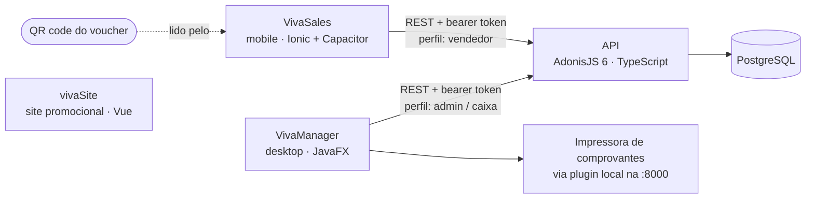

[English](README.md)

#  VivaPay

**Sistema de pagamento fechado, baseado em vouchers, feito para uma feira escolar de três dias.**

O VivaPay substituiu o dinheiro em espécie na **VivaCTI**, a feira anual do CTI-UNESP (Bauru, Brasil). Os visitantes usavam um voucher com QR code, recarregado nos caixas em um aplicativo desktop. Os vendedores de 40 barracas cobravam esse voucher pelo aplicativo móvel. O sistema foi desenvolvido por uma equipe de estudantes que liderei, durante nosso curso técnico em Informática (2022–2024). Ele funcionou ao vivo por 3 dias consecutivos, com mais de 5.000 usuários e 10.000 transações.

---

## Impacto

| Métrica | Valor |
|---|---|
| Operação ao vivo | 3 dias consecutivos na VivaCTI |
| Usuários | 5.000+ |
| Transações | 10.000 |
| Barracas de vendedores | 40 |
| Volume processado | ~R$ 10.000 |
| Equipe | 7 desenvolvedores estudantes, 2 orientadores |

---

## Como funciona

Três grupos usam o sistema, e cada um tem seu próprio cliente:

| Quem | Cliente | O que faz |
|---|---|---|
| Organizadores / caixas | **VivaManager** (desktop) | Cadastrar eventos e lojas, recarregar ou estornar vouchers, imprimir comprovantes, gerar relatórios em PDF, consultar cancelamentos |
| Vendedores | **VivaSales** (mobile) | Fazer login, ler o QR code do voucher do visitante, consultar o saldo, cobrar um pagamento, ver o histórico de vendas e comprovantes |
| Visitantes | **Viva Voucher** (QR code) | Usar um voucher com QR code que guarda um saldo |

O saldo de um voucher não é armazenado como um número mutável. Ele é **calculado a partir de um registro de transações que só recebe inserções**: créditos menos débitos e estornos (`api/app/models/ClienteEvento.ts`). A API recusa um pagamento quando o evento está inativo, quando o vendedor não está vinculado ao evento ou quando o saldo é insuficiente.

## Arquitetura



- Os dois clientes se comunicam apenas com a API. Nenhum acessa o banco de dados diretamente.
- A API emite tokens de acesso opacos em `POST /login` e protege grupos de rotas por perfil (`admin` ou `vendedor`). Veja `api/start/routes.ts`.
- O `vivaSite` é uma página promocional independente, com links de download. Ele não chama a API.
- Os dois clientes têm a URL da API fixa no código: `https://tcc-r46r.onrender.com` (uma hospedagem no Render).

## Estrutura do repositório

| Pasta | Parte | Stack |
|---|---|---|
| [`api/`](api) | Backend REST | Node.js, TypeScript, **AdonisJS 6**, Lucid ORM, PostgreSQL, VineJS, pdfkit, Swagger (`adonis-autoswagger`) |
| [`apptcc/`](apptcc) | **VivaSales**, aplicativo móvel do vendedor | **Ionic 8 + Vue 3**, Vite, Capacitor 6 (projetos Android e iOS), Tailwind CSS, Axios |
| [`views/`](views) | **VivaManager**, aplicativo desktop do organizador/caixa | **Java 22, JavaFX (FXML)**, Maven, OkHttp, iText (PDF) |
| [`vivaSite/`](vivaSite) | Site promocional | Vue 3, Vite, Bootstrap 5 |
| [`vivaEmail/`](vivaEmail), [`Downloads/`](Downloads) | Template de e-mail e página estática de download | HTML |

O esquema do banco é definido pelas migrations em [`api/database/migrations/`](api/database/migrations). Ele cobre instituições, usuários, administradores, vendedores, eventos, vínculos vendedor↔evento e cliente↔evento, transações e tabelas de auditoria de cancelamentos.

## Como rodar localmente

### 1. API (`api/`)

Requisitos: Node.js ≥ 20.6 (exigido pelo AdonisJS 6) e um banco PostgreSQL.

```bash
cd api
npm install
cp .env.example .env          # preencha os valores
node ace generate:key         # grava o APP_KEY no .env
node ace migration:run        # cria o esquema
npm run dev                   # http://localhost:3333
```

- A interface do Swagger fica em `/docs`.
- O `.env.example` lista todas as variáveis que a aplicação lê. As variáveis de SMTP são obrigatórias na inicialização, mesmo que nenhum e-mail seja enviado.
- Não há script de seed, e o cadastro de administrador não está exposto como rota. A primeira conta de administrador precisa ser inserida diretamente no banco.

### 2. Aplicativo móvel VivaSales (`apptcc/`)

```bash
cd apptcc
npm install
npm run dev                   # pré-visualização no navegador (Vite)

# Build Android
npm run build
npx cap sync android
npx cap open android          # compilar e executar pelo Android Studio
```

O aplicativo chama a API publicada que está fixa no código, não a sua API local. Apontá-lo para `localhost` exigiria uma alteração no código.

### 3. Aplicativo desktop VivaManager (`views/`)

Requisitos: JDK 22.

```bash
cd views
./mvnw package
java -jar target/VivaManager-1.0-jar-with-dependencies.jar
```

- Execute de dentro de `views/`: o aplicativo salva o arquivo de sessão no caminho relativo `src/main/resources/config.properties`.
- A impressão de comprovantes usa o plugin de impressora térmica do parzibyte (`ConectorPluginV3`). O plugin precisa estar rodando localmente em `http://localhost:8000`.
- Assim como o aplicativo móvel, ele chama a API publicada que está fixa no código.

### 4. Site (`vivaSite/`)

```bash
cd vivaSite
npm install
npm run dev
```

## Limitações conhecidas

Este foi um projeto estudantil feito para um único evento. Vale saber:

- **Não há testes automatizados.** Existe apenas a estrutura gerada pelos frameworks. A validação aconteceu no uso real durante a feira.
- **A URL da API está fixa no código** dos dois clientes, sem configuração por ambiente.
- **Valores monetários são armazenados como `double`**, e não como centavos inteiros ou tipo decimal.
- **A verificação de saldo e a inserção do débito não estão em uma transação de banco de dados**, então pagamentos simultâneos no mesmo voucher podem entrar em condição de corrida.
- Código, identificadores e textos da interface estão em português.

## Meu papel

Liderei a equipe de 7 desenvolvedores estudantes, com 2 docentes orientadores.
Projetei a arquitetura, escrevi a API e o aplicativo desktop, e orientei o desenvolvimento do aplicativo móvel. Também cuidei da publicação, da configuração do banco de dados e da integração com a impressora.

## Equipe

| Nome | Função |
|---|---|
| Vinicius Castelli (eu) | Liderança da equipe |
| Ana Luísa Leal | Product Owner |
| Luiz Felipe Matosinho | Tech Lead |
| Juliana Ayumi Tano | Desenvolvimento |
| Richard Walace de Oliveira Camargo | Desenvolvimento |
| Leticia Garcia de Oliveira | Desenvolvimento e Social Media |
| Ana Elisa Avante Dourado | Desenvolvimento e Social Media |
| André Luiz Ribeiro Bicudo | Orientação docente |
| Vitor Assis Camargo | Orientação docente |

Desenvolvido no Colégio Técnico Industrial da UNESP, Bauru, Brasil.
